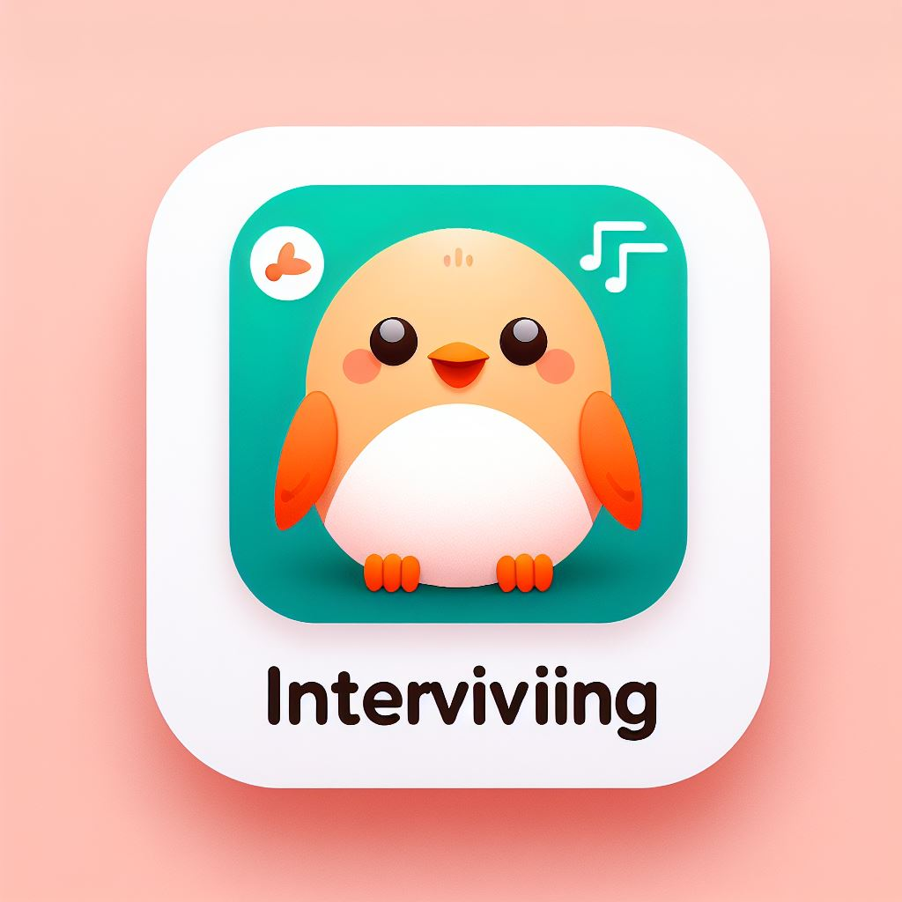

<h2 align="center">
  SBA-318: Express Server Application  
</h2>

<h3 align="center">
  Interviviing: From Tech Skills to Interview Brilliance!
</h3>
<h5>
My journey as a professional software engineer taught me that technical skills are just one piece of the puzzle. To prepare for upcoming job interviews, I created Interviviing, tailored to my shared experiences with my friends. Interviviing would help me and my friends prepare for the tough interview questions. I hope that I will confidently tackle interviews.
</h5>

## Development Time
> **Skill development:** 2024.04.18. - 2024.04.10.
> **Computation:** 2024.04.21.

## Live Demo

> **Please click this link** :
> 

## Designer and Developer

|      Hannah Moon       |                                                                                                                        
| :------------------------------------------------------------------------------: |  
|       |  
|   [@Hannah-Moon](https://github.com/Hannah-Moon)   |   

## Problem to solve

As a fellow dog lover, I totally understand the struggle of finding dog-friendly restaurants using Google's search services alone. Those scattered online directories like BringFido.com and sifting through pet-friendly tags on Yelp can feel like a bit of a hassle! But fear not! With a handy solution like Doogie, dog owners can breeze through the process and easily sniff out restaurants where they can enjoy a meal with their furry companions. Happy dining!  

  
[@Source](https://support.google.com/maps/thread/209225954/no-option-for-dog-friendly-in-features-section?hl=en)

---
## Tools 🛠️

### Environment

             

### Development

### Questions
> **Behavioral questions** : Various resource  
> **Technical questions** : https://intellipaat.com/blog/interview-question/full-stack-developer-interview-questions/#12  
> **Questions to ask** : https://hbr.org/2022/05/38-smart-questions-to-ask-in-a-job-interview?ab=hero-subleft-2

---
## Key Feature 📦

### ⭐️ TBA
- TBA

---
## Reflection 📦
- TBA

---
## Design Process 🖌️
The design was created in Figma.

<a href="https://hannah-moon.github.io/24_SBA_308A_JavaScript-Web-Application/"></img></a>
